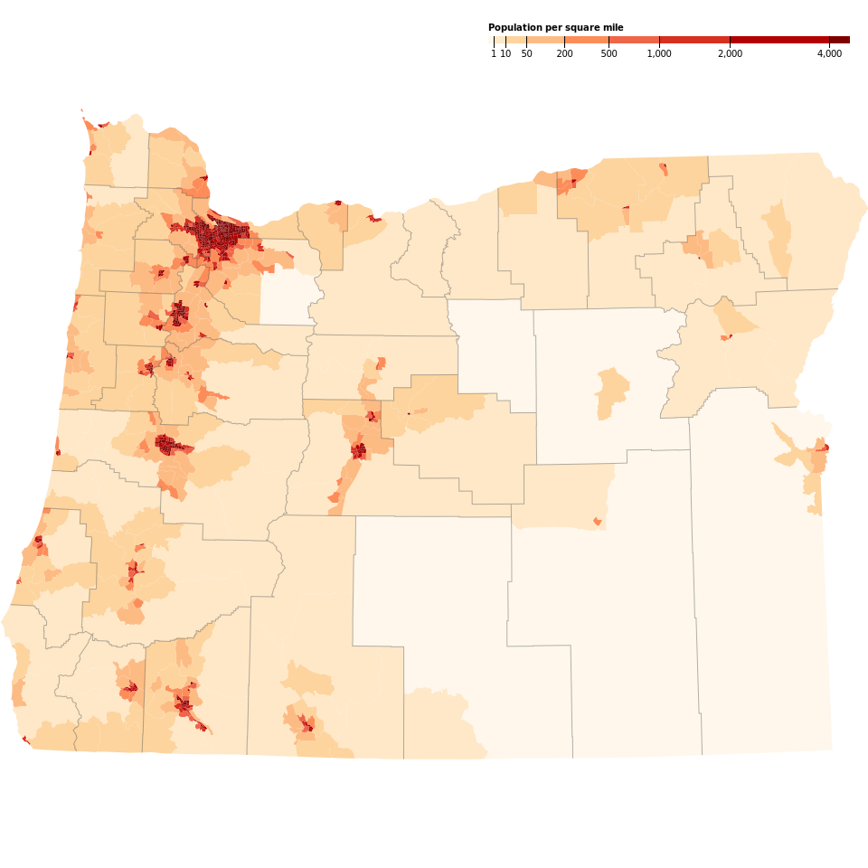

# Mapping

Open source tools, tips and tricks for mapping lovers

## Cool Websites

- [QGIS 3](https://www.qgis.org/en/site/)
- [Arch Geo Tux](https://archgeotux.sourceforge.io/)

## Data Sources I use

- [Centro de descargas del IGM](http://centrodedescargas.cnig.es/CentroDescargas/)
- [Universidad de Extremadura](http://secad.unex.es/conocimiento/)
- [ICGC](https://www.icgc.cat/Descarregues)

## Adding support to ECW, JPEG2000 and MrSID file formats with GDAL in Arch Linux

- Uninstall GDAL if present

- Download the ERDAS ECW JP2 SDK v5.4 (or later) Linux
  - [Download the ERDAS ECW JP2 SDK v5.4 (or later) Linux](https://download.hexagongeospatial.com/downloads/ecw/erdas-ecw-jp2-sdk-v5-4-linux?result=true)
  - Unzip and run `./ERDAS_ECWJP2_SDK-5.4.0.bin`
  - At the menu, select 1 for "Desktop Read-Only Redistributable"
  - Accept the license agreement 
  - `sudo cp -r ~/hexagon/ERDAS-ECW_JPEG_2000_SDK-5.4.0/Desktop_Read-Only /usr/local/hexagon`
  - `sudo rm -r /usr/local/hexagon/lib/x64`
  - `sudo mv /usr/local/hexagon/lib/newabi/x64 /usr/local/hexagon/lib/x64`
  - `sudo cp /usr/local/hexagon/lib/x64/release/libNCSEcw* /usr/local/lib`
  - `sudo ldconfig /usr/local/hexagon`

- Download and install MrSID DSDK
  - Download [MrSID DSDK](https://www.extensis.com/support/developers) for linux 64 and GCC 5
  - Unzip and move the folder to home

- Build GDAL
  -  Download the source code [here](https://trac.osgeo.org/gdal/wiki/DownloadSource)
  -  Unzip and enter the folder
  -  Set your options `./configure CXXFLAGS=-D_GLIBCXX_USE_CXX11_ABI=0 --with-ecw=/usr/local/hexagon --with-mrsid=~/MrSID_DSDK-9.5.4.4709-rhel6.x86-64.gcc531/Raster_DSDK --with-mrsid_lidar=~/MrSID_DSDK-9.5.4.4709-rhel6.x86-64.gcc531/Lidar_DSDK --without-libtool`
  -  Remove old builds `make clean`
  -  Compile with all cores `make -j8`
  -  Install `sudo make install`

 Check the format is now supported:

`gdalinfo --formats | grep -i ecw mrsid`

## Arch Geo Tux repository

There is an [Arch Geo Tux](https://archgeotux.sourceforge.io/) repository with some useful packages. Add this repository to `/etc/pacman.conf`

```bash
[archgeotux]
SigLevel = Optional TrustAll
Server = https://downloads.sourceforge.net/project/archgeotux/$arch
```

Add the database file for this new repo `sudo pacman -Sy`

## 3D Printing topography maps with QGIS3

You need a digital elevation model (DEM) of the area you want to cover.

## cli cartography Oregon

Following <https://medium.com/@mbostock/command-line-cartography-part-1-897aa8f8ca2c>

Projection obtained from <https://github.com/veltman/d3-stateplane>

API Key is required for US Census Data https://data.census.gov/cedsci/

```bash
curl 'https://www2.census.gov/geo/tiger/GENZ2020/shp/cb_2020_41_tract_500k.zip' -o cb_2020_41_tract_500k.zip

unzip cb_2020_41_tract_500k.zip

sudo npm install -g shapefile

shp2json cb_2020_41_tract_500k.shp -o or.json

sudo npm install -g d3-geo-projection

geoproject 'd3.geoConicConformal().parallels([44 + 20 / 60, 46]).rotate([120 + 30 / 60, 0]).fitSize([960, 960], d)' < or.json > or-albers.json

geo2svg -w 960 -h 960 < or-albers.json > or-albers.svg

sudo npm install -g ndjson-cli

ndjson-split 'd.features' < or-albers.json > or-albers.ndjson

ndjson-map 'd.id = d.properties.GEOID.slice(2), d' < or-albers.ndjson > or-albers-id.ndjson

curl 'https://api.census.gov/data/2020/dec/pl?get=P1_001N&for=tract:*&for=county:*&in=state:41&key=c925e274479a21b29ebd41d4e86516edfa1cd9efERASETHIS' -o or-county-populations.json

ndjson-cat or-county-populations.json | ndjson-split 'd.slice(1)' | ndjson-map '{id: d[2]+d[3],P1: +d[0]}' > or-county-populations.ndjson

ndjson-join 'd.id' or-albers-id.ndjson or-county-populations.ndjson > or-albers-join.ndjson

ndjson-map 'd[0].properties = {density: Math.floor(d[1].P1 / d[0].properties.ALAND * 2589975.2356)}, d[0]' < or-albers-join.ndjson > or-albers-density.ndjson

ndjson-reduce < or-albers-density.ndjson | ndjson-map '{type: "FeatureCollection", features: d}' > or-albers-density.json

sudo npm install -g d3@6.7

ndjson-map -r d3 '(d.properties.fill = d3.scaleSequential(d3.interpolateViridis).domain([0, 4000])(d.properties.density), d)' < or-albers-density.ndjson > or-albers-color.ndjson

geo2svg -n --stroke none -p 1 -w 960 -h 960 < or-albers-color.ndjson > or-albers-color.svg

sudo npm install -g topojson-client topojson-server topojson-simplify

geo2topo -n tracts=or-albers-density.ndjson > or-tracts-topo.json

toposimplify -p 1 -f < or-tracts-topo.json > or-simple-topo.json

topoquantize 1e5 < or-simple-topo.json > or-quantized-topo.json

topomerge -k 'd.id.slice(0,3)' counties=tracts < or-quantized-topo.json > or-merge-topo.json

topomerge --mesh -f 'a !== b' counties=counties < or-merge-topo.json > or-topo.json

topo2geo tracts=- < or-topo.json | ndjson-map -r d3 'z = d3.scaleSequential(d3.interpolateViridis).domain([0,4000]),d.features.forEach(f => f.properties.fill = z(f.properties.density)),d' | ndjson-split 'd.features' | geo2svg -n --stroke none -p 1 -w 960 -h 960 > or-tracts-color.svg

sudo npm install -g d3-scale-chromatic@2

topo2geo tracts=- < or-topo.json | ndjson-map -r d3 -r d3-scale-chromatic 'z = d3.scaleThreshold().domain([1, 10, 50, 200, 500, 1000, 2000, 4000]).range(d3.schemeOrRd[9]),d.features.forEach(f => f.properties.fill = z(f.properties.density)),d' | ndjson-split 'd.features' | geo2svg -n --stroke none -p 1 -w 960 -h 960 > or-tracts-threshold.svg

(topo2geo tracts=- < or-topo.json | ndjson-map -r d3 -r d3-scale-chromatic 'z = d3.scaleThreshold().domain([1, 10, 50, 200, 500, 1000, 2000, 4000]).range(d3.schemeOrRd[9]),d.features.forEach(f => f.properties.fill = z(f.properties.density)),d' | ndjson-split 'd.features' ; topo2geo counties=- < or-topo.json | ndjson-map 'd.properties = {"stroke": "#000", "stroke-opacity": 0.3}, d') | geo2svg -n --stroke none -p 1 -w 960 -h 960 > or.svg
```

- Note 1: The constant 2589975.2356 = 1609.34² converts the land area from square meters to square miles.
- Note 2: The density value is floored rather than rounded. We don’t need the extra precision
- Note 3: As of 4th March 2022 ndjson-cli does not support importing ES modules so you should use D3 v.6.7. Same happens with d3-scale-chromatic 

Create the legend:

```svg
<?xml version="1.0" encoding="utf-8"?>
<!DOCTYPE svg PUBLIC "-//W3C//DTD SVG 1.1//EN" "http://www.w3.org/Graphics/SVG/1.1/DTD/svg11.dtd">
<svg version="1.1" xmlns="http://www.w3.org/2000/svg" xmlns:xlink="http://www.w3.org/1999/xlink" width="960" height="1100" viewBox="0 0 960 1100" fill="none">
  <g transform="translate(540,40)" font-size="10" font-family="sans-serif" text-anchor="middle">
    <rect height="8" x="0" width="6" fill="#fff7ec"></rect>
    <rect height="8" x="6" width="13" fill="#fee8c8"></rect>
    <rect height="8" x="19" width="23" fill="#fdd49e"></rect>
    <rect height="8" x="42" width="42" fill="#fdbb84"></rect>
    <rect height="8" x="84" width="49" fill="#fc8d59"></rect>
    <rect height="8" x="133" width="56" fill="#ef6548"></rect>
    <rect height="8" x="189" width="78" fill="#d7301f"></rect>
    <rect height="8" x="267" width="110" fill="#b30000"></rect>
    <rect height="8" x="377" width="23" fill="#7f0000"></rect>
    <text x="0" y="-6" fill="#000" text-anchor="start" font-weight="bold">Population per square mile</text>
    <g transform="translate(6,0)">
      <line stroke="#000" y2="13" x1="0.5" x2="0.5"></line>
      <text fill="#000" y="16" x="0.5" dy="0.71em">1</text>
    </g>
    <g transform="translate(19,0)">
      <line stroke="#000" y2="13" x1="0.5" x2="0.5"></line>
      <text fill="#000" y="16" x="0.5" dy="0.71em">10</text>
    </g>
    <g transform="translate(42,0)">
      <line stroke="#000" y2="13" x1="0.5" x2="0.5"></line>
      <text fill="#000" y="16" x="0.5" dy="0.71em">50</text>
    </g>
    <g transform="translate(84,0)">
      <line stroke="#000" y2="13" x1="0.5" x2="0.5"></line>
      <text fill="#000" y="16" x="0.5" dy="0.71em">200</text>
    </g>
    <g transform="translate(133,0)">
      <line stroke="#000" y2="13" x1="0.5" x2="0.5"></line>
      <text fill="#000" y="16" x="0.5" dy="0.71em">500</text>
    </g>
    <g transform="translate(189,0)">
      <line stroke="#000" y2="13" x1="0.5" x2="0.5"></line>
      <text fill="#000" y="16" x="0.5" dy="0.71em">1,000</text>
    </g>
    <g transform="translate(267,0)">
      <line stroke="#000" y2="13" x1="0.5" x2="0.5"></line>
      <text fill="#000" y="16" x="0.5" dy="0.71em">2,000</text>
    </g>
    <g transform="translate(377,0)">
      <line stroke="#000" y2="13" x1="0.5" x2="0.5"></line>
      <text fill="#000" y="16" x="0.5" dy="0.71em">4,000</text>
    </g>
  </g>
</svg>
```

And insert the legend into the map

`sed '$d' legend.svg && tail -n +4 < legend.svg >> or.svg`

The result: 


